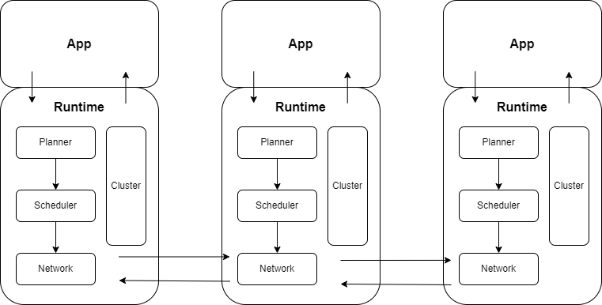

# datafusion-dist

[](https://crates.io/crates/datafusion-dist)
[](https://docs.rs/datafusion-dist/latest/datafusion_dist/)

A distributed streaming execution library for [Apache DataFusion](https://datafusion.apache.org/).

## Overview

datafusion-dist enables distributed query execution for DataFusion, allowing you to scale analytical workloads across multiple nodes.



1. The application sends a physical plan to the runtime, which returns data stream back to the application.
2. The cluster manages nodes and their states; the runtime sends heartbeats to the cluster periodically.
3. The planner breaks down the physical plan into stages.
4. The scheduler assigns stages to nodes based on cluster state.
5. The network layer handles communication between nodes.

### Example

Consider a SQL query: `SELECT * FROM t1 JOIN t2 ON t1.name = t2.name`

1. The application parses the SQL and creates a physical plan:
```
CoalesceBatchesExec: target_batch_size=8192
  HashJoinExec: mode=Partitioned, join_type=Inner, on=[(name@0, name@0)]
    CoalesceBatchesExec: target_batch_size=8192
      RepartitionExec: partitioning=Hash([name@0], 12), input_partitions=2
        DataSourceExec: partitions=2, partition_sizes=[1, 1]
    CoalesceBatchesExec: target_batch_size=8192
      RepartitionExec: partitioning=Hash([name@0], 12), input_partitions=2
        DataSourceExec: partitions=2, partition_sizes=[1, 1]
```

2. The application sends the physical plan to the runtime. The runtime uses the planner to break down the physical plan into stages:
```
===============Stage 0 (partitions=12)===============
CoalesceBatchesExec: target_batch_size=8192
  HashJoinExec: mode=Partitioned, join_type=Inner, on=[(name@0, name@0)]
    ProxyExec: delegated_plan=CoalesceBatchesExec, delegated_stage=2
    ProxyExec: delegated_plan=CoalesceBatchesExec, delegated_stage=1
===============Stage 1 (partitions=12)===============
CoalesceBatchesExec: target_batch_size=8192
  RepartitionExec: partitioning=Hash([name@0], 12), input_partitions=2
    DataSourceExec: partitions=2, partition_sizes=[1, 1]
===============Stage 2 (partitions=12)===============
CoalesceBatchesExec: target_batch_size=8192
  RepartitionExec: partitioning=Hash([name@0], 12), input_partitions=2
    DataSourceExec: partitions=2, partition_sizes=[1, 1]
```

3. The runtime uses the scheduler to assign stages to nodes:
```
0/{0,3,6,9},1/{0,1,2,3,4,5,6,7,8,9,10,11}->localhost:50060, 0/{1,4,7,10}->localhost:50070, 0/{2,5,8,11},2/{0,1,2,3,4,5,6,7,8,9,10,11}->localhost:50080
```

4. The runtime returns tickets to the application, which can use them to fetch the data stream.

## Features

- Distributed streaming execution for DataFusion plans
- Pluggable cluster management (PostgreSQL supported)
- Pluggable network layer (Tonic/gRPC supported)
- Extensible planner for custom stage planning
- Extensible scheduler for custom task scheduling

## Project Structure

```
datafusion-dist/
├── dist/                 # Core distributed execution library
├── clusters/
│   └── postgres/         # PostgreSQL-based cluster management
├── networks/
│   └── tonic/            # gRPC network layer using Tonic
└── integration-tests/    # Integration test suite
```

## License

This project is licensed under the MIT License — see the [LICENSE](LICENSE) file for details.